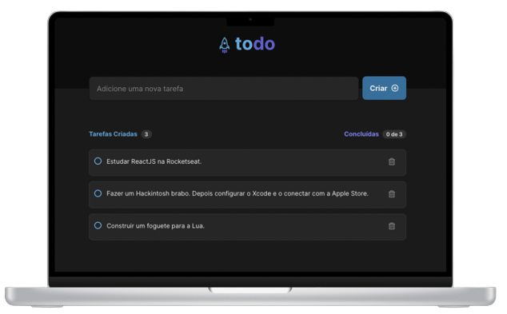
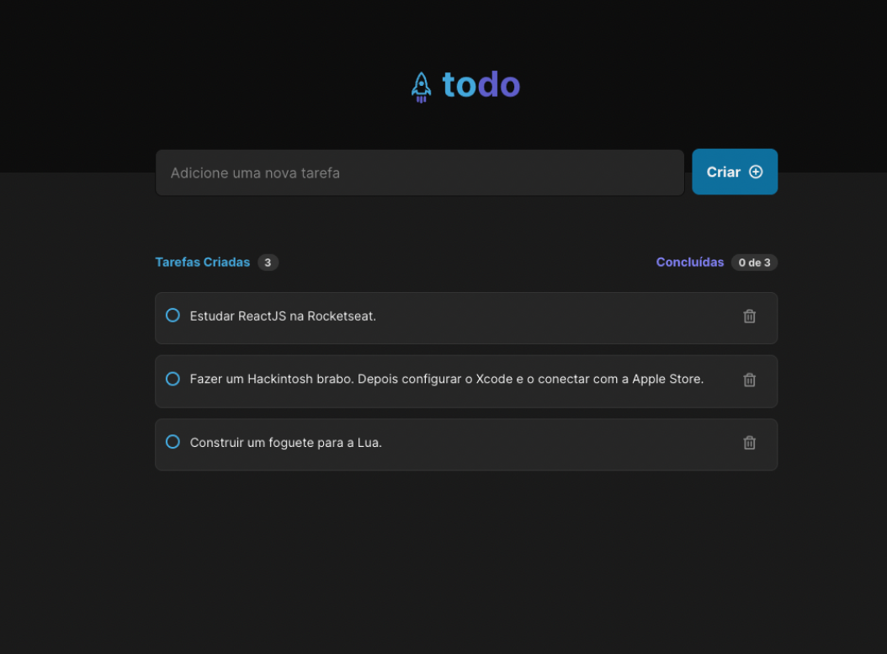
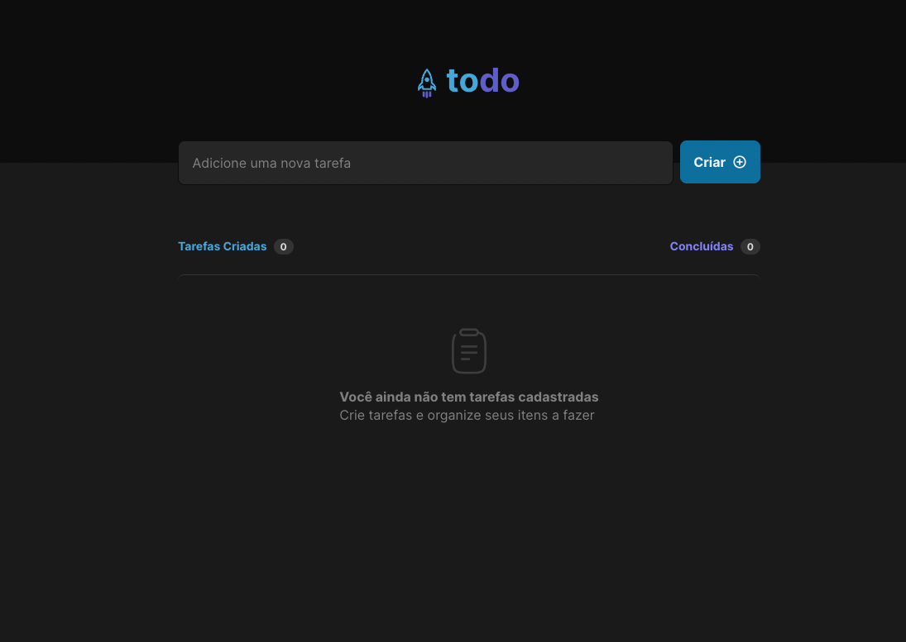

<h1 align="center">
  </img>
</h1>

<p align="center">
  <a href="#ℹ-description">Description</a> •
  <a href="#-demo">Demo</a> •
  <a href="#-technologies">Technologies</a> •
  <a href="#-how-to-use">How to use</a> 
</p>

<p align="center">
  </img>
</p>

## ℹ Description

> This application is a **to-do list** made with ReactJS and TypeScript.

The application has the following features:

- Add a new task
- Mark and unmark a task as complete
- Remove a task from the list
- Show task completion progress

## 💻 Demo

<p align="center"><p>

### Screenshots






## 🛠 Technologies

### Frontend

- [**React**](https://reactjs.org/)
- [**Vite**](https://vitejs.dev/)


_Others requirements can be seen on the package.json file_

## 🖥 How to use

```bash
# clone this repo and access its folder
$ git clone https://github.com/andrevks/rocketist && rocketist

# Initiate frontend
$ npm install
$ npm run dev 
```

---

<p align="center">Made with 💜 by <a href="https://github.com/andrevks">André Geraldo</a></p>
